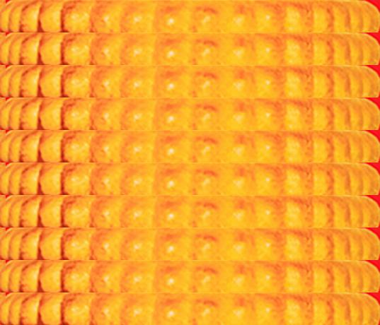

# Oreore

This application allows you to split an image between letters in some word into parts
and compose them together to create your own "OREO meme".
The OREO meme is an internet meme where the letters of some word are rearranged to form other
words like and the image is changed according to the new order.

## Installation

1. Clone this repository to your computer using
   `https://github.com/IWillChangeTheNameLater/Oreore.git`
2. Install the required packages by running the following command
   (only Pillow==9.5.0):
   `pip install -r requirements.txt`
3. Run the `main.py` script to start using the program.

## Usage

To use this application, follow these steps:

1. Open the command prompt or terminal on your computer.
2. Navigate to the directory where you cloned the repository using `cd <path_to_repository>`
3. Run the following command to start the application: `python main.py`
4. Follow the instructions in the command prompt/terminal to enter the path to the image file,
   the initial name of the image (you can type anything), and the final name of the image
   according to which you want to change it.
5. After the conversion is complete, the output image file will be saved in the same directory
   as the source image file.

### Or

Just run the `Oreore.exe` executable file.

## Example

By running the program in the current directory and specifying
the path to the file as 'oreo.jpeg ',
the original name as 'oreo',
and the final name as 'oreore', 'ooooooooooo' or 'error'
we get the following images respectively:

The source image:

The output 'oreore' image:

The output 'oooooooooo' image:

The output 'error' image:

